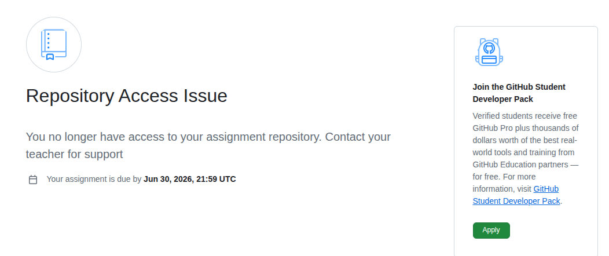
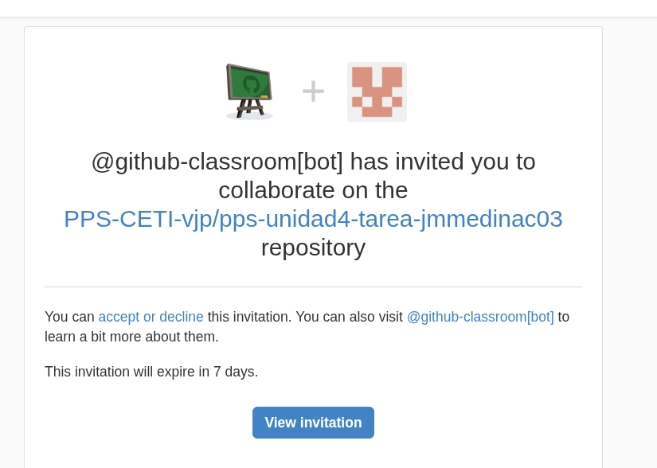
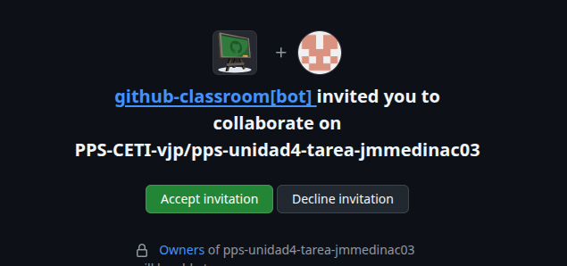
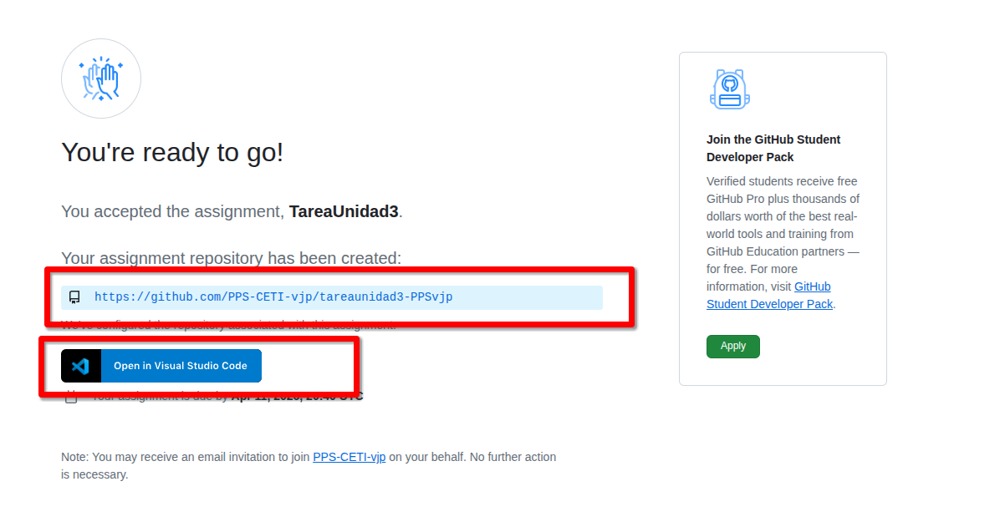
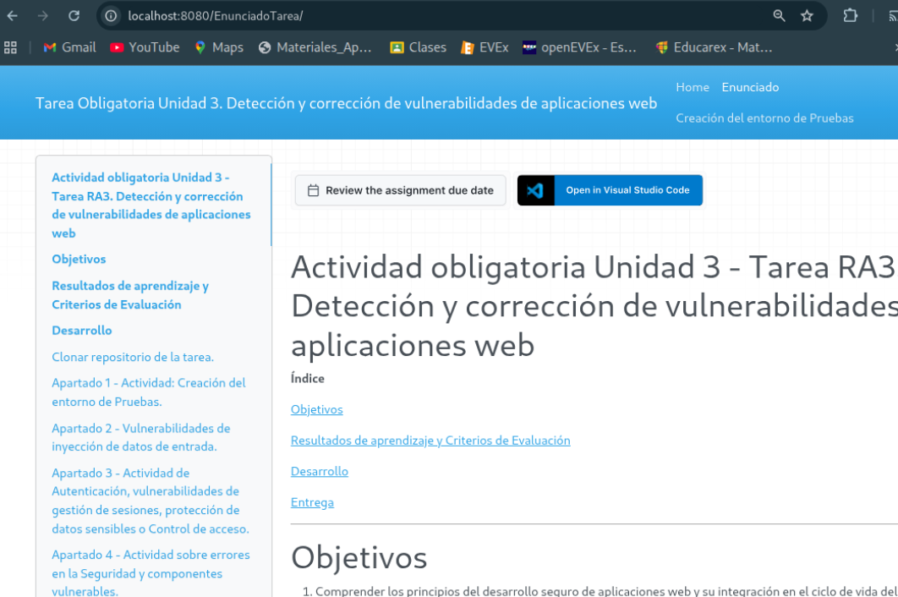

# Tarea Unidad 2 - Tarea RA2. Niveles de seguridad requeridos por las aplicaciones.

**Lee la tarea hasta el final** para ver lo que tienes que entregar e ir cogiendo las evidencias y ver lo que tienes que documentar.

**Índice**

[Objetivos](#objetivos)

[Resultados de aprendizaje y Criterios de Evaluación](#resultados-de-aprendizaje-y-criterios-de-evaluación)

[Desarrollo](#desarrollo)

[Entrega](#entrega)

---

# OBJETIVOS
- Saber manejar las principales listas en fuentes abiertas sobre vulnerabilidades, debilidades, etc., saber relacionarlas y  extraer información de ellas.
- Saber aplicar el estandar ASVS e identificar las comprobaciones a realizar en una aplicación según el nivel de seguridad de la misma.
---

# RESULTADOS DE APRENDIZAJE Y CRITERIOS DE EVALUACION

Esta actividad se relaciona con el resultado de aprendizaje y criterios de evaluación RA 1 a, b,c, d y e.

---
# PREPARAR EL REPOSITORIO

Utilizaremos **`GitHub Classroom`** para la entrega de esta actividad.

- Usa este código de invitación que tienes en la plataforma `Moodle` para realizar esta tarea.

1. Pincha en el enlace y **acepta la asignación**.


2. Es posible que te aparezca un mensaje de problemas de acceso al repositorio:



3. Si es así es posible que recibas en el email vinculado a tu `Github`, un correo con la asignación.



4. Pincha en el enlace que te ha llegado al correo, **acepta la asignación** y sigue los pasos que te indican.



5.  Puedes acceder a la tarea desde el **enlace de `github` o** clonando el repositorio **desde `Visual Studio Code`**.



6. Ya podrás **acceder al repositorio** con la tarea a realizar.

7. **Guarda la dirección ya que está tarea no aparecerá en tu repositorio** al ser un repositorio del classroom https://github.com/PPS-CETI-vjp/NombreTarea-TuUSUARIOGITHUB

**Si le das a Acceder con Visual Studio Code**, tendrás que dar a permitir abrir, enlaces, descargar extensiones para vscode, confiar en los autores,etc. Se creará tu repositorio en `$HOME/Github-classroom/`.


- Si le das al repositorio, te llevará a tu repositorio. Te habrá creado un repositorio en tu espacio personal de `github classroom` que tendrás que modificar.


- Desde mi panel de control tendré acceso a tu repositorio, o sea que **ya no tendrás que poner tu repositorio como público**. Como profesor, yo tendré acceso.

---

# DESARROLLO

> **Nota importante**    
> Documenta explicando claramente los procesos realizados, incluyendo fragmentos de código con los comandos utilizados y/o adjuntado las capturas de pantallas necesarias que demuestren que has realizado las operaciones, así como el resultado de los productos.
>
> Las capturas de pantalla serán a pantalla completa y deberá visualizarse tu nombre en el terminal o bien la imagen de tu usuario en la plataforma.
>
> Deberás de añadir como colaborador en tu repositorio de GitHub al profesor: `PPSvjp` **Settings** > **Collaborators**.
Lee la tarea hasta el final para ver lo que tienes que entregar e ir cogiendo las evidencias y ver lo que tienes que documentar.

Lee la tarea hasta el final para ver lo que tienes que entregar e ir cogiendo las evidencias y ver lo que tienes que documentar.

En esta ocasión la Tarea consiste en la realización de las tres actividades propuestas durante la unidad.

## Apartado 1 - Trazado de vulnerabiliad.

Este es el desarrollo de la actividad [Actividad-TrazadoVulnerabilidad](../Actividad-TrazadoVulnerabilidad/README.md).

Realiza lo indicado en la sección `Entrega` de la actividad.

## Apartado 2 - Análisis de vulnerabilidad en máquina vulnerable.

Este es el desarrollo de la actividad [Actividad-MaquinasVulnerables](../Actividad-MaquinasVulnerables/README.md). 

Realiza lo indicado en la sección `Entrega` de la actividad.


## Apartado 3 - Comprobación de los requisitos de Seguridad de una aplicación.

Este es el desarrollo de la actividad [Actividad-ComprobaciónREquisitosSeguridadAplicación](../Actividad-ComprobacionRequisitosSeguridadAplicacion/README.md). 

Realiza lo indicado en la sección `Entrega` de la actividad.


## Apartado 4 - Reflexión sobre los riesgos de las aplicaciones.

Deberás de hacer una reflexión personal explicando los riesgos de la aplicación que hemos utilizado en el apartado anterior, y si son los mismo riesgos que otro tipo de aplicación: bancaria, de salud, de RRSS, es decir, una reflexión sobre los **riesgos de las aplicaciones** desarrolladas, en **función de sus características**.

---

# ENTREGA
## Indicaciones de entrega

Al acceder a la tarea en `classroom.github.com` se te ha creado un repositorio en tu espacio de `Github Classroom`. En él es en el que tendrás que documentar la realización de los diferentes apartados de la tarea.

> Observa que al ser repositorio privado, no te va a permitir configurar `GitHub Pages`. No obstante **deberás configurar `Mkdocs` para que genere las páginas html** sobre los archivos `.md` donde estás documentando todo.
> Recuerda **añadir toda la estructura de `mkdocs`**, `requeriments.txt` y el `workflow` de `GitHub Actions` para que se genere la documentación en la rama `GH-Pages`.
>
> **Para visualizar los archivos `html`** que se están creando con ` mkdocs`, con php podemos **crear un servidor web** para visualizar los archivos creados: `php -S 0:8080` nos muestra el contenido web del directorio actual, por lo que si yo estoy en la rama `gh-pages` podré ver los archivos `html` generados.

```bash
# creo una carpeta donde visualizar mi web
mkdir /ruta/a/carpeta/web
# Clono mi respositorio
git clone Mirespositorio/MiTareaUnidadX.git 
# Me coloco en la carpeta clonada
cd MiTareaUnidadX
# Me cambio a la rama gh-pages
git checkout gh-pages
# Levantamos el servidor web con php
php -S 0:8080
```

Visualizaríamos el contenido web de nuestro respositorio en <http://localhost:8080>



---

Una vez realizada la tarea, el envío se realizará a través de la plataforma.

**Deberás de entregar** al menos:

- El **repositorio** que has creado, **comprimido** en un archivo.
- El **enlace** a tu repositorio en la página de `classroom.github.com`.

La documentación generada en la rama `gh-pages` del repositorio (*recuerda que se generan los archivos .md colocados en la carpeta docs*) debe de contener al menos:
- Archivo **Index.md** con enlace al resto de secciones.

La documentación en `GitHub Pages` debe de contener al menos:
- Archivo **Index.md** con **secciones**:
  
    - **Apartado 1 - Trazado de vulnerabiliad**: donde figure la documentación sobre el trazado de la vulnerabilidad que has realizado en la actividad [Actividad-TrazadoVulnerabilidad](../Actividad-TrazadoVulnerabilidad/README.md). El repositorio deberá contener el registro de CVE o `CVE Record` en formato `json` que has descargardo.

    - **Apartado 2 - Análisis de vulnerabilidad en máquina vulnerable**: En ella documentarás brévemente la explotación y securización de la vulnerabilidad que hemos realizado en la [Actividad-MaquinasVulnerables](../Actividad-MaquinasVulnerables/README.md). Recuerda que en esa actividad hemos creado el archivo `analisisVulnerabilidad.md`. 

    - **Apartado 3 - Comprobación de los requisitos de Seguridad de una aplicación**: En ella documentarás el análisis de la comprobación de los requisitos de seguridad que has realizado en la [Actividad-ComprobaciónREquisitosSeguridadAplicación](../Actividad-ComprobacionRequisitosSeguridadAplicacion/README.md). Recuerda que en ella hemos realizado el documento `ComprobacionRequisitosAplicacion_Tu_nombre.md` junto con la **hoja de cálculo** con la comprobación de los requisitos.

    - **Apartado 4 - Reflexión sobre los riesgos de las aplicaciones**: En ella deberás de hacer una reflexión personal explicando los riesgos de la aplicación que hemos utilizado en el apartado anterior, y si son los mismo riesgos que otro tipo de aplicación: bancaria, de salud, de RRSS, es decir, una reflexión sobre los **riesgos de las aplicaciones** desarrolladas, en **función de sus características**.


El archivo comprimido se nombrará siguiendo las siguientes pautas:

`PPS-Unidad-TareaRA-Apellido1_Apellido2_Nombre`

Asegúrate que el nombre no contenga la letra ñ, tildes ni caracteres especiales extraños. Así por ejemplo la alumna Begoña Sánchez Mañas para la primera unidad del MP de PPS, debería nombrar esta tarea como...

PPS-Unidad2-TareaRA2-sanchez_manas_begona

## Calificación de la tarea

La puntuación de los apartados es la siguiente:

Si **no se adjunta el repositorio comprimido, no se indica la dirección del enlace a la documentación en GitHub.io o no se añade como colaborador en el repositorio al profesor**, la tarea será **calificada como 0**

> NOTA IMPORTANTE
> 
>Aquellos apartados/subapartados en los que las capturas de pantalla no sean claras o no tengan como fondo de pantalla la plataforma con tu usuario mostrando claramente la foto de tu perfil, no serán corregidos.

En el resto de los casos, la puntuación de los apartados es la siguiente:

1. Apartado 1 - Trazado de vulnerabiliad (hasta 2 puntos).
1. Apartado 2 - Análisis de vulnerabilidad en máquina vulnerable (hasta 2 punto).
1. Apartado 3 - Comprobación de los requisitos de Seguridad de una aplicación (hasta 2 puntos).
1. Apartado 4 - Reflexión sobre los riesgos de las aplicaciones (hasta 1 punto).
1. Apartado 5 - Documentación: presentación, extensión, exactitud, riqueza en síntaxis de MarkDown, etc de la documentación del repostorio. (hasta 3 puntos).

---
[](https://creativecommons.org/licenses/by-nc-sa/4.0/)
