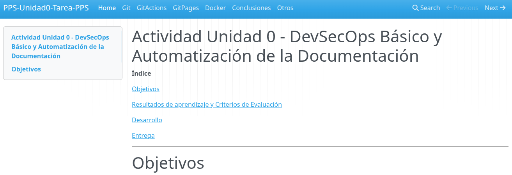

# Tarea Unidad 0 - RA5. Tarea para entregar Unidad0

**Lee la tarea hasta el final** para ver lo que tienes que entregar e ir cogiendo las evidencias y ver lo que tienes que documentar.

**Índice**

[Objetivos](#objetivos)

[Resultados de aprendizaje y Criterios de Evaluación](#resultados-de-aprendizaje-y-criterios-de-evaluación)

[Desarrollo](#desarrollo)

[Entrega](#entrega)

---

# OBJETIVOS
Esta actividad tiene como objetivo poner en práctica los contenidos tratados en esta unidad:
- Lenguaje de marcas MarkDown.   
- Sistemas de control de versiones: Git.   
- Creación y administración de contenedores: Docker.  
- Ciclos de desarrollo software seguros: SecDevOps.  
- Documentación.  

---

# RESULTADOS DE APRENDIZAJE Y CRITERIOS DE EVALUACION

Esta actividad se relaciona con el resultado de aprendizaje y criterios de evaluación RA 5 a, b, c y g.

---
# PREPARAR EL REPOSITORIO

Utilizaremos **`GitHub Classroom`** para la entrega de esta actividad.

- Usa este código de invitación que tienes en la plataforma `Moodle` para realizar esta tarea.

1. Pincha en el enlace y **acepta la asignación**.


2. Es posible que te aparezca un mensaje de problemas de acceso al repositorio:


3. Si es así es posible que recibas en el email vinculado a tu `Github`, un correo con la asignación.


4. Pincha en el enlace que te ha llegado al correo, **acepta la asignación** y sigue los pasos que te indican.


5.  Puedes acceder a la tarea desde el **enlace de `github` o** clonando el repositorio **desde `Visual Studio Code`**.


6. Ya podrás **acceder al repositorio** con la tarea a realizar.

7. **Guarda la dirección ya que está tarea no aparecerá en tu repositorio** al ser un repositorio del classroom https://github.com/PPS-CETI-vjp/NombreTarea-TuUSUARIOGITHUB

**Si le das a Acceder con Visual Studio Code**, tendrás que dar a permitir abrir, enlaces, descargar extensiones para vscode, confiar en los autores,etc. Se creará tu repositorio en `$HOME/Github-classroom/`.


- Si le das al repositorio, te llevará a tu repositorio. Te habrá creado un repositorio en tu espacio personal de `github classroom` que tendrás que modificar.


- Desde mi panel de control tendré acceso a tu repositorio, o sea que **ya no tendrás que poner tu repositorio como público**. Como profesor, yo tendré acceso.

---

# DESARROLLO

> **Nota importante**    
> Documenta explicando claramente los procesos realizados, incluyendo fragmentos de código con los comandos utilizados y/o adjuntado las capturas de pantallas necesarias que demuestren que has realizado las operaciones, así como el resultado de los productos.
>
> Las capturas de pantalla serán a pantalla completa y deberá visualizarse tu nombre en el terminal o bien la imagen de tu usuario en la plataforma.
>
> Deberás de añadir como colaborador en tu repositorio de GitHub al profesor: `PPSvjp` **Settings** > **Collaborators**.

## 1. Creación del repositorio

En esta ocasión no debes de utilizar el repositorio creado en este classroom, sino que deberas crear un repositorio en `GitHub.com` con nombre `PPS-Unidad0-Tarea-Tu_nombre`.  
Deberás documentar las diferentes fases o partes de la tarea en MarkDown en diferentes archivos. 

La base del repositorio es la misma que hemos utilizado en [Actividad-DevSecOps](https://github.com/jmmedinac03vjp/PuestaProduccionSegura/blob/main/Unidad0-Herramientas/Actividad-DevSecOps/README.md).

Una aproximación de la estructura del repositorio sería el siguiente (puedes hacer los modificaciones que creas convenientes):

```
PPS-Unidad0-Tarea-Tu_nombre/  
├── calculator/  
│   ├── __init__.py  
│   └── gui.py  
├── docs/  
│   └── index.md    
│   └── git.md  
│   └── gitActions.md   
│   └── gitPages.md  
│   └── docker.md  
│   └── conclusiones.md 
├── mkdocs.yml   
├── requirements.txt  
└── .github/  
    └── workflows/  
        └── CreacionDocumentacion.yml  
```
- En `index.md` se encontrará un apartado introductorio relativo con la tarea y un índice con los enlaces al resto de documentos.
- En `git.md` se encontrará la documentación del proceso de las operaciones realizadas para la creación del repositorio.
- En `gitActions.md` se encontrará la documentación del proceso de las operaciones de creación y comprobación del WorkFlow para la creación de la estructura de archivos necesarios para crear una web estática con `MkDocs`.
- En `docker.md` se encontrará la documentación del proceso de las operaciones de creación y puesta en marcha del servicio `NGinx` donde se mostrará la documentación de la actividad.
- En `conclusiones.md` el apartado de tus conclusiones.

## 2. Creación de WorkFlow de `GitHub Actions`

Crea un WorkFlow para que se genere la documentación cada vez que hacemos un `push` en el repositorio.
> Recuerda que tendrás que modificar el fichero de configuración de `mkdocs` para que aparezcan las diferentes secciones que hemos visto antes.
> Además recuerda cambiar la sección `site_name` del archivo.

## 3. Vinculación con GitHub Pages

Configura el repositorio para habilitar `GitHub Pages` y que nos muestre la documentación de la tarea.

Debería tener una apariencia tal que así:



> Recuerda que en la entrega tendrás que entregar también la dirección de la página del repositorio  en `github.io`.

## 4. Creación de un contenedor de servicios `NGINX` con Docker.

La idea de esta sección es levantar un contenedor `NGINX` para publicar la documentación de la tarea.
La pregunta es: ¿Parece absurdo crear un servicio para publicar documentación cuando ya está pública en `github.io`. La respuesta es: es absurdo, pero es la forma de evaluar la adquisición de los conocimientos en `Docker` por lo tanto:

> ¡¡¡¡ESTO PUEDE SERTE ÚTIL!!!!
> Recuerda que la documentación generada por mkdocs, se guarda en una rama con nombre `gh-pages`.
>
> Podemos esperar entonces que si estamos en ese repositorio y nos cambiamos a esa rama `git checkout gh-pages` nos encontremos en nuestro directorio de trabajo toda la estructura y archivos que contiene nuestra página web estática.
> 
> Por otra parte ya sabemos que para persistir información en `Docker`, podemos añadir volúmenes `bind mount` a nuestras máquinas, por lo que podemos hacer que el contenido de nuestro repositorio se monte en el contenedor de `NGINX` para mostrar la información de nuestra actividad.

Por lo tanto, crea un contenedor de servicios `NGINX` mediante alguna de las siguientes formas (sólo una):
- Contenedor Docker.
- Creación de imagen con dockerfile.
- Docker-compose

**Características de la máquina**:
- Nombre del contenedor: PPSUnidad0-Tarea_Tu_nombre
- Puerto redirigido al puerto 8085 de nuestra máquina anfitriona.
- `Bind-Mount` de la carpeta de nuestro repositorio

> Explica brevemente el proceso de creación del centenedor y no te olvides de adjuntar capturas de pantalla de:
- Creación de la máquina.
- Visualización de la página web en el puerto 8085.
- Captura de pantalla o archivo con toda la información sobre el contenedor (`docker inspect`.)

---

# ENTREGA
## Indicaciones de entrega

Una vez realizada la tarea, el envío se realizará a través de la plataforma. 
Deberás de entregar al menos:

- El repositorio que has creado, comprimido en un archivo.
- El enlace a la página de `github.io` donde está publicado la documentación de esta actividad. 
- Revisa que has añadido como colaborador en tu repositorio de GitHub al profesor: `PPSvjp` **Settings** > **Collaborators**.

El archivo comprimido se nombrará siguiendo las siguientes pautas:

PPS-Unidad0-Tarea-Apellido1_Apellido2_Nombre

Asegúrate que el nombre no contenga la letra ñ, tildes ni caracteres especiales extraños. Así por ejemplo la alumna Begoña Sánchez Mañas para la primera unidad del MP de PPS, debería nombrar esta tarea como...

PPS-Unidad0-Tarea-sanchez_manas_begona

## Calificación de la tarea

La puntuación de los apartados es la siguiente:

Si **no se adjunta el repositorio comprimido, no se indica la dirección del enlace a la documentación en GitHub.io o no se añade como colaborador en el repositorio al profesor**, la tarea será **calificada como 0**

> NOTA IMPORTANTE
> 
>Aquellos apartados/subapartados en los que las capturas de pantalla no sean claras o no tengan como fondo de pantalla la plataforma con tu usuario mostrando claramente la foto de tu perfil, no serán corregidos.

En el resto de los casos, la puntuación de los apartados es la siguiente:

- Apartado 1. Creación del repositorio  (hasta 1,5 puntos).  
- Apartado 2. Creación de WorkFlow de `GitHub Actions` (hasta 1,5 puntos).  
- Apartado 3. Vinculación con GitHub Pages (hasta 1,5 puntos).  
- Apartado 4. Creación de un contenedor de servicios `NGINX` con Docker(hasta 1,5 puntos).  
- Apartado 5. Documentación: presentación, extensión, exactitud, riqueza en síntaxis de MarkDown, etc. (hasta 4 puntos).

---
[](https://creativecommons.org/licenses/by-nc-sa/4.0/)
